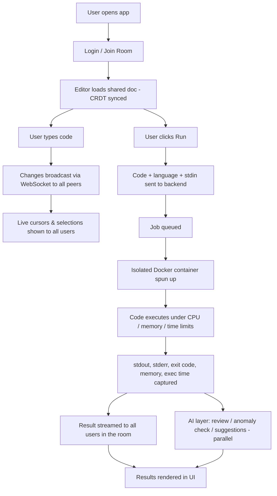

# 🧩 Collab Code Sandbox — Collaborative Code Editor with Sandboxed Execution

**IT-314 Software Engineering | Group 32**

[]()
[]()

> Real-time collaborative code editor with CRDT-based live sync and Docker-sandboxed code execution, with AI-powered code review and ML-based anomaly detection.

---

## Overview

A web-based collaborative code editor where multiple users can write code together in real time, with live cursor sync, and run it safely inside isolated Docker containers. Execution results (stdout, stderr, exit code, memory, time) stream back to everyone in the room. An AI layer adds code review and inline suggestions, backed by an ML model that flags anomalous execution behavior.

This README describes the project's intended design and setup. As development progresses, sections below will be updated to reflect what's actually implemented.

---

## Planned Features

- 🔄 Real-time collaborative editing (Monaco Editor + Yjs CRDT)
- 🖱️ Live cursors & presence
- 🚪 Shareable rooms — join instantly via link
- ▶️ Sandboxed execution in isolated, resource-limited Docker containers
- 🤖 AI-powered code review and inline suggestions
- 🚨 ML-based anomaly detection on execution metrics

---

## Architecture (Planned)
 
### High-Level User Journey
 


---

## Tech Stack

| Layer | Tech |
|---|---|
| Frontend | Next.js, React, Monaco Editor, Yjs |
| Real-time Sync | WebSockets |
| Execution & Sandbox Service | Spring Boot, Docker, Redis (job queue) |
| Database | PostgreSQL |
| AI/ML Service | Python, Claude/OpenAI API, scikit-learn |

---

## Project Status
 
🚧 **Planning / Initial Setup** — architecture and tech stack finalized, implementation starting. This README will be updated with actual run instructions, screenshots, and API docs as each subsystem lands.
 
---

## Getting Started

Setup instructions will be added here once the initial project scaffolding is in place for each service.

```bash
git clone https://github.com/<your-org>/collab-code-sandbox.git
cd collab-code-sandbox
```

## Contributing

1. Create a feature branch: `git checkout -b feature/my-feature`
2. Commit your changes: `git commit -m "Add my feature"`
3. Push and open a Pull Request — CI must pass before merge.

Track work on the repo's **Projects** board. All other project discussion happens on the team Slack.
