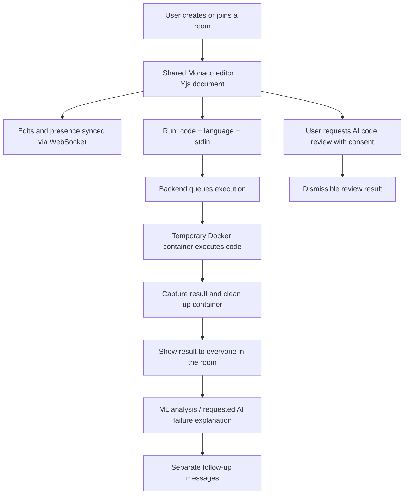

# 🧩 Collab Code Sandbox — Collaborative Code Editor with Sandboxed Execution

**IT-314 Software Engineering | Group 32**


> Real-time collaborative code editor with CRDT-based live sync and Docker-sandboxed code execution, with AI-powered code review and ML-based anomaly detection.

---

## Overview

A web-based collaborative code editor where multiple users can write code together in real time, see live cursors, and run code safely inside isolated Docker containers. Execution results are shared with everyone in the room, with stdout and stderr separate from the planned exit-code, memory, and time metrics.

An AI layer provides on-demand code review and short failure explanations. A separate ML model flags unusual execution behavior. Execution results arrive first; AI/ML follow-up messages never delay them. External AI features require user consent and remain optional.

This README describes the project's intended design and current setup. Run instructions will be added as the service implementations land.

---

## Planned Features

- 🔄 Real-time collaborative editing (Monaco Editor + Yjs CRDT)
- 🖱️ Live cursors, selections, presence, and automatic reconnection
- 🚪 Shareable rooms — instant join by default, with optional owner approval and read-only guests
- ▶️ Sandboxed execution in temporary, isolated, resource-limited Docker containers
- 📤 Shared output and execution metrics for everyone in the room
- 🤖 On-demand, dismissible AI code review and short failure explanations, gated by consent
- 🚨 Non-blocking ML anomaly warnings based on execution metrics
- 🌐 Support for C++, Python, C, Java, and JavaScript, delivered in stages

---

## Architecture (Planned)

### High-Level User Journey


```mermaid
flowchart TD
    A["User creates or joins a room"] --> B["Shared Monaco editor + Yjs document"]
    B --> C["Edits and presence synced via WebSocket"]
    B --> D["Run: code + language + stdin"]
    D --> E["Backend queues execution"]
    E --> F["Temporary Docker container executes code"]
    F --> G["Capture result and clean up container"]
    G --> H["Show result to everyone in the room"]
    H --> I["ML analysis / requested AI failure explanation"]
    I --> J["Separate follow-up messages"]
    B --> K["User requests AI code review with consent"]
    K --> L["Dismissible review result"]
```

### Current Repository Structure

| Path | Purpose |
|---|---|
| `client/` | Frontend editor and room interface |
| `sync-service/` | Spring Boot WebSocket relay for collaborative editing |
| `execution-service/` | Spring Boot execution API and Docker runner |
| `ai-ml-service/` | Separate Python AI/ML service |
| `docs/` | Requirements, EPICs/sprints, stakeholder elicitation, backlog, and conflict log |
| `.pre-commit-config.yaml` | Shared pre-commit hook configuration |
| `.gitignore` | Files excluded from version control |

The service folders are scaffold locations; their presence does not mean the services are implemented. Platform responsibilities (auth, room ownership, data, and infrastructure) are assigned a service home through T-05.

---

## Tech Stack

| Layer | Tech |
|---|---|
| Frontend | React, Monaco Editor, Yjs; client framework/build setup recorded in T-01 |
| Real-time Sync | Java / Spring Boot, WebSockets |
| Execution & Sandbox Service | Java / Spring Boot, self-managed Docker containers |
| Platform / Data | Java / Spring Boot; database and queue choices documented as finalized |
| AI/ML Service | Python, LLM API, scikit-learn |

Endpoint paths, ports, and payloads are agreed in T-06 (service contracts) and T-07 (execution-to-AI/ML contract). Judge0 and Piston are references only, not the runtime.

---

## Project Status

🚧 **Sprint 1 / Initial Implementation** — project documentation and backlog are prepared, the repository structure is in place, and **22 Sprint 1 issues** have been created and assigned.

Sprint 1 covers scaffolding, contracts, basic collaborative editing, room links/display names, Docker execution with shared output, owner identity, secret scanning, CI, and an integration-test skeleton. Minimal internal AI/ML prototypes are also planned; user-facing AI features follow after consent is implemented.

**Sprint 1 target: 12 October 2026. Mid-evaluation: 13 October 2026.** Follow progress in [Issues](https://github.com/Yash-Oza-ui/collab-code-sandbox/issues) and the **IT-314 Sprint Board** Project.

### Team Roles

| Team | Members |
|---|---|
| Frontend | Het Kapadiya, Niranjan Panchal, Chandan Luhar |
| Execution & Sandbox Engine | Jay Limbasiya, Quincy Vadi, Bhavya Vekariya, Yash Oza |
| AI/GenAI + ML | Digvijay Parmar, Chandan Luhar, Prince Gadara |
| Platform / Auth / DB / Infra / QA | Femina Rathod, Yash Oza |

---

## Getting Started

```bash
git clone https://github.com/Yash-Oza-ui/collab-code-sandbox.git
cd collab-code-sandbox
```

Service-specific setup instructions will be added as scaffolds merge. Follow the shared pre-commit setup before contributing; never commit API keys or real `.env` files.

---

## 🌿 Git Branch Naming Conventions

All team members must follow these branch naming rules. Use a short, descriptive name with hyphens and include the issue ID where applicable.

| Convention | Use | Example |
|---|---|---|
| `feature/<name>` | New features or core functionality | `feature/US-01-create-room` |
| `docs/<name>` | Documentation and team workbooks | `docs/T-06-api-contracts` |
| `fix/<name>` | Bug fixes or test failure fixes | `fix/US-02-sync-binding` |
| `test/<name>` | Test suite additions | `test/US-09-container-cleanup` |
| `refactor/<name>` | Code restructuring | `refactor/T-03-execution-service` |
| `ci/<name>` | CI/CD workflow updates | `ci/T-09-build-checks` |

For existing Sprint 1 issues, follow the branch names already stated in their **PR Instructions** to avoid confusion. The conventions above apply to new work and follow-ups.

> ❌ Direct pushes to `main` are forbidden. All changes must go through a Pull Request under the repository's branch-protection rules.

## Contributing

1. Open your assigned issue and read the objective, acceptance criteria, your part, dependencies, and PR instructions. Comment `My part: ...` before starting.
2. Update your local `main` and create your issue branch:

   ```bash
   git switch main
   git pull --ff-only origin main
   git switch -c feature/US-01-create-room
   ```

3. Implement your part, run the required tests and secret scan, then commit and push.
4. Open a PR, attach the requested test evidence, and request the named reviewer. **One approval and a passing required CI build are needed before merging.**
5. For co-assigned issues, each person opens their own PR and follows the specified merge order. The partial PR uses `Part of #<GitHub issue number>`; only the completing PR uses `Closes #<GitHub issue number>`.

Keep **US-XX** (user story) and **T-XX** (technical task) IDs. Team labels are `Frontend` + `editor`, `Backend` + `execution-sandbox`, `ai-ml`, and `DevOps` + the relevant work-area label. Every current Sprint 1 issue has `sprint-1`, its EPIC, and its priority label.

Track work on the **IT-314 Sprint Board**. Discuss implementation and blockers in Slack `#dev`; post sprint updates in the team's sprint channel.
